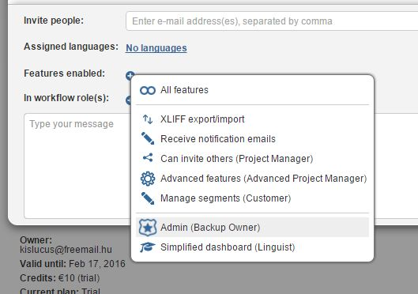

# Sharing settings

In the world of website localization, it is rare for a project to be realized by a single person. As project owner or backup owner, use the Sharing settings dialog to invite people into the project and assign roles/editing roles to any one of them.

At the bottom of the Dialog, you will see the line, "Invite People:" if you click on the field, the invitation settings part of the dialog will slide up, allowing you to enter further details of the project participant to be added. You can assign languages, enable admin/access features and workflow roles for each user you invite. You can do this by clicking on the blue plus icon next to each of those options. Make your choices in the small pop-up lists. **These settings are not final, you can change them later.**

## Features

The various **features**, (administrative rights) deserve to be detailed, Here they are:

**All features**: every feature you see below the separator in the list will be added for the user. Note that this has a potential to cause problems: If, for example, you simultaneously set __Advanced features__ and __Manage segments__, it results in an editing rights conflict. There are security implications you need to consider when giving your users rights, so use this feature with care.

**XLIFF export/import**: enables XLIFF export/import of segments for the user. Especially important for those users who will be coordinating the translation effort throughout the project.

**Receive notification e-mails**: Add user to the list of recipients of Discovery/Content Scan/Alarm, etc notifications.

**Can invite others**: designates the user as a Project Manager, able to invite others onto the project. Take care not to include other, conflicting roles, such as __Customer__, which could re-restrict access.

**Advanced features**: give the user the power to edit languages as well as any entry in the project, and editing most setting, up to, and including, the URL inclusion-exclusion rules. Segmentation, publishing and certain advanced settings remain beyond the reach of the user.

**Manage segments**: make the user a Customer, with the ability to manage (approve or exclude) pending source segments. The user will also require a workflow role and an assigned target language to access the Workbench to manage segments. **WARNING! This right restricts the user to this role, other features will be disabled!**

**NOTE** __Features__ are predominantly important from a project management viewpoint. __Workflow roles__, on the other hand, are used to manage user interaction __on the Workbench__, based on expertise (whether a user is a translator, proofreader or client will decide what sets of segments are available to them for editing - see the documentation of the Workbench for details).

After a user redeems their invitation using the link they receive in an e-mail, their address and username will appear under the owner. Their features and workflow roles can be edited in the list.

You can invite as many participants to the translation project as you'd like. You can also enable e-mail notifications for any of them by checking the notification icon in the last column.

## Project Roles

Based on the project features that are available for a user, the following project ropes are available:

* **Owner**: Every project has an owner with unlimited powers over the project: the owner may add or remove anyone on the project, edit any entry in any language, including adding new languages, any change any setting, including the advanced ones. There can only be one owner on a project, but owners may renounce ownership, designating another user and setting their own privileges.

* **Backup Owners**: same as project owners. They can change any setting and entry, add or remove users, and modify language settings.

* **Project Managers**: can invite others onto the project. Other features and roles can be added as well. Take care not to include other, conflicting roles (restrictions override rights)

* **Advanced Project Managers**: they can edit languages, as well as any entry in the project. They can change most setting, up to and including the URL inclusion-exclusion rules. They cannot change segmentation rules or publishing settings. A few Advanced settings are also beyond their reach.

* **Linguists**: have access to the Simplified Dashboard and Content menu. They are only allowed to edit segments in their designated language and workflow role. They can receive notification emails about project updates, and may be given the power to import/export XLIFF files.

* **Contributors**: default users, capable of editing any entry in their selected language and workflow role, but nothing else. They may receive notification emails and project update emails, but they may not edit their features, nor invite anyone else, nor access any of the advanced settings.

* **Customer**: This role intended for a representative of the customer who excercises oversight over content. This role is read-only, meaning despite the target language added to the user, they are unable to actually make edits. They can _Approve_ or _Exclude_ segments.

### Client Approval

Sometimes there is need for the client to view and check new segments before they enter the translation workflow.

In the **Advanced Settings** menu, default state of new segments can be set to the following:

- Pending

- Excluded

- Approved

When set to Pending or Excluded, new segments picked up will acquire that state automatically and manual approval is needed.  In the Sharing Settings menu, the customer role can be assigned for this purpose.

**Important:** The client role is read-only. Anyone assigned this role won't be able to edit content, but approve them for translation. If you are unable to edit segments on the Workbench, please check Sharing Settings first.
